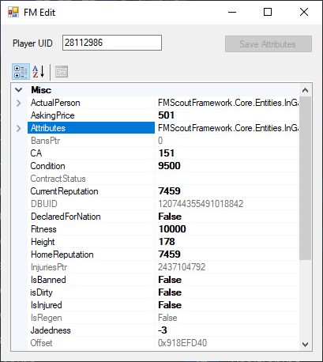

# Football Manager Explorer

This repo contains:
- an experimental script that can export data to CSV
- an experimental player editor

## Dependencies

These tools rely on FMScoutFramework.dll which can be found in releases of [FMSE](https://www.fmscout.com/a-fm-scout-editor-2019.html) or newer versions.

We depend on .NET framework 4.6.1 and support x64 only, because so does FMSE. We might be able to use 4.7/4.8 but I haven't tried.

## Build

1. Do something I don't remember to resolve/install nuget packages
2. Build the solution/project with visual studio, or just run a sufficiently new version of MSBuild.exe from the top level directory.

## Run

First copy FMScoutFramework.dll to the relevant build output directory (e.g. bin/debug)

fmdump: just run the executable and it will produce some CSV files in the current directory.

fmedit: the editor will load the game state on startup. Enter the UID of a player into the field at the top, and a bunch of properties will be shown. You can edit player attributes and positions under the Attributes property and then press Save Attributes to save your changes. Changes to other fields cannot be saved right now.

Logs from the fm scout library go to log.txt in the working directory, logs from my script go to stdout.

## Development

For development vscode seems to work but VS is recommended because the editor is a windows forms app. Make sure you have .NET framework 4.6.1 targetting pack. I think  any .NET Framework >= 4.6.1 SDK will suffice.
